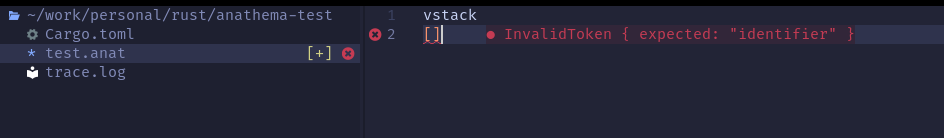

# Anathema LSP

This is a simple language server for the Anathema template language.

Once built, ensure that the `anathema-lsp` binary is in your `$PATH`.

## Editors
### Neovim

To enable the lsp for neovim, add the following to your `init.lua`:

```lua
vim.api.nvim_create_autocmd("BufEnter", {
  pattern = "*.aml",
  callback = function()
    vim.lsp.start({
      name = "anathema-lsp",
      cmd = { "anathema-lsp" },
      root_dir = vim.fs.dirname(vim.fs.find({ "Cargo.toml" }, { upward = true })[1]),
    })
  end,
})
```

This will start the lsp when you open a file with the `.anat` extension.

### Vscode
To build:
```bash
cd clients/vscode
npm install
```

To debug the lsp in vscode, first create a `launch.json` file in `.vscode/` with the following contents:
```
    "version": "0.2.0",
    "configurations": [
        {
            "type": "extensionHost",
            "request": "launch",
            "name": "Debug LSP Extension",
            "runtimeExecutable": "${execPath}",
            "env": {
                "RUST_LOG": "debug"
            },
            "args": [
              "--extensionDevelopmentPath=${workspaceRoot}/anathema-lsp/clients/vscode",
              "--disable-extensions",
              "${workspaceRoot}/anathema-lsp/"
            ]
          }
    ]
}
```
Run the debugger and open the provided `test.anat` file to test the lsp.

## Features

Currently, the following features are supported:
- Diagnostics that show any compilations errors

